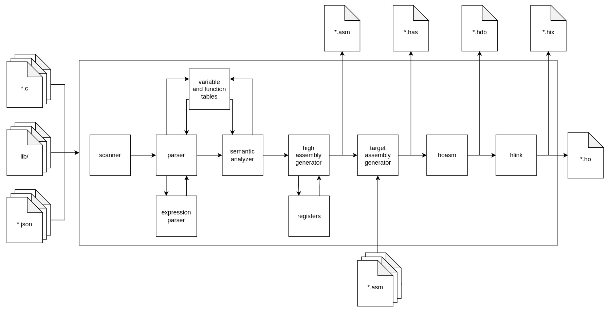

# HaDes Instruction Set Compiler
The HaDes Instruction Set Compiler (compiler) is a compiler of a subset of the C language (C source code). 

## Architecture
The architecture of the compiler is depicted in the diagram below:


The purpose of the visualized stages is the following:
* **Scanner** reads the input program and separates it to tokens, e.g. identifiers, keywords, numbers etc. The separation to tokens is implemented with regular expressions.
* **Parser** parses the input program, checks if it is syntactically correct and populates the variable as well as the function tables. The parsing is accomplished via a pushdown automaton.
* **Expression parser** parses arithmetic and logic expression. It is called by the parser and it again uses a pushdown automaton to accomplish it's task. The output of the expression parser is the input expression converted to a postfix notation.
* **Variable table** stores information about defined variables in different scopes.
* **Function table** stores information about defined functions and their bodies converted to internal representation.
* **Sematic analyzer** performs semantic analysis of the compiler program.
* **High assembly generator** generates a high assembly supporting instructions and notations, which are not available in the HaDes instruction set. 
* **Target assembly generator** converts the program in high assembly to the HaDes assembly.
* **Hoasm** is the provided `hoasm.exe` program, which compiles the HaDes assembly.
* **Hlink** is the provided `hlink.exe` program, which links the compiled HaDes assembly to a final binary file.

### Inputs
The inputs of the compiler can be not only C source code files, but also JSON files describing implemented functions in a high assembly file and location of this file. Such described functions are then callable from the C source code and vice versa the high assembly code can call the C functions as well.

Having inputs both in C source code and the in the high assembly has several benefits. It allows to write drivers for the peripheral devices and interrupt handlers, which would otherwise require significant extension of the compilable C source code. Additionally, the high assembly code enables optimizations of some performance critical parts of the compiled programs.

### Outputs
The compiler produces several outputs. It can produce in total up to 5 different outputs:
1. **`*asm` file** containing the source code compiled into a single high assembly file,
2. **`*has` file** containing the source code compiled into a single HaDes assembly file,
3. **`*hdb` file** containing debug info, i.e. comments from the source code and comments generated by the compiler,
4. **`*ho` file** containing the source code compiled into a HaDes object file,
4. **`*hix` file** containing the source code compiled and linked into a final binary file.

## Support
The following listing summarizes the supported C language constructs:
* only integer data type,
* 1D arrays and pointers with static allocation,
* integers in decimal numeral system,
* characters,
* function calls,
* `if`, `else if`, `else` statements,
* `while` loops,
* `for` loops with all 3 fields of the header filled,
* arithmetic (excluding division), logic and bitwise operators as well as operators `<<<` and `>>>` for rotation bit shifts,
* indexation and dereference of pointers/arrays,
* `true` and `false` values,
* line comments.

## Usage
```
python3 compiler.py [-h] [-a ASSEMBLY [ASSEMBLY ...]] [-s] [-i INTERMEDIATE] [-o OUTPUT] [-c] [-nl] [-nb] [-g GLOBAL_VARIABLES] [-d] file_names [file_names ...]

positional arguments:
  file_names            Names of files to be compiled.

options:
  -a ASSEMBLY [ASSEMBLY ...], --assembly ASSEMBLY [ASSEMBLY ...]
                        Names of configuration files with linkable high level assembly.
  -s, --same            Use the name of first input file as names for output files.
  -i INTERMEDIATE, --intermediate INTERMEDIATE
                        Name of a file to write compiled code to high level assembly.
  -o OUTPUT, --output OUTPUT
                        Name of a file to write compiled code to HaDes assembly.
  -c, --compile         Compile to binary.
  -nl, --no_library     Do not include library functions.
  -nb, --no_build_in    Do not include build in functions.
  -g GLOBAL_VARIABLES, --global_variables GLOBAL_VARIABLES
                        Name of a file containing global variable definitions.
  -d, --debug           Print the internal state of the compiler to stderr.
```

## Sample programs
There are several sample programs in the `sample_programs/` directory.

### Paint
Paint is the largest and most interesting program. It uses large variety of the available peripheral devices. Compile the program with:
```
python compiler.py sample_programs/paint.c -s -c -a sample_programs/paint_interrupt_handling.json 
```

### Echo
Program to echo the input from the UART peripheral device back as an output. Compile the program with:
```
python compiler.py sample_programs/echo.c -s -c
```

### Fibonacci
Program to compute the Nth value (provided via the UART peripheral device) of the Fibonacci sequence using recursion. Compile the program with:
```
python compiler.py sample_programs/fibonacci.c -s -c
```

### Divide By 10
Program to divide a given number (provided via the UART peripheral device) by 10 using a software implementation with shifts, additions and multiplication. Compile the program with:
```
python compiler.py sample_programs/divide_by_10.c -s -c
```

### Display number
Program to display a number (provided via the UART peripheral device) smaller than 10 000 on the 7-segment display. Compile the program with:
```
python compiler.py sample_programs/display_number.c -s -c
```

## Library
The `lib/` directory contains a library function, which mostly handle access to the peripheral devices. All the functions implemented in multiple files in this directory are automatically linked against the provided input source code of the compiler.
