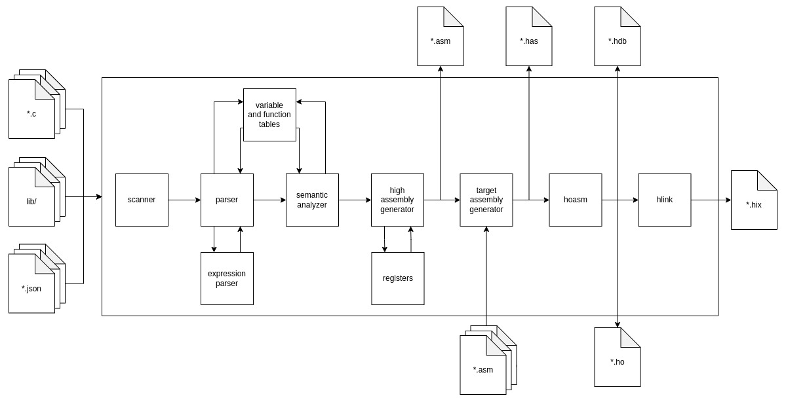

# HaDes Instruction Set Compiler
The HaDes Instruction Set Compiler (compiler) is a compiler of a subset of the C language (C source code). 

## Architecture
The architecture of the compiler is depicted in the diagram below:

The purpose of the visualized stages is the following:
* **Scanner** reads the input program and separates it to tokens, e.g. identifiers, keywords, numbers etc. The separation to tokens is implemented with regular expressions.
* **Parser** parses the input program, checks if it is syntactically correct and populates the variable as well as the function tables. The parsing is accomplished via a pushdown automaton.
* **Expression parser** parses arithmetic and logic expression. It is called by the parser and it again uses a pushdown automaton to accomplish it's task. The output of the expression parser is the input expression converted to a postfix notation.
* **Variable table** stores information about defined variables in different scopes.
* **Function table** stores information about defined functions and their bodies converted to internal representation.
* **Sematic analyzer** performs semantic analysis of the compiler program.
* **High assembly generator** generates a high assembly supporting instructions and notations, which are not available in the HaDes instruction set. 
* **Target assembly generator** converts the program in high assembly to the HaDes assembly.
* **Hoasm** is the provided `hoasm.exe` program, which compiles the HaDes assembly.
* **Hlink** is the provided `hlink.exe` program, which links the compiled HaDes assembly to a final binary file.

### Inputs
The inputs of the compiler can be not only C source code files, but also JSON files describing implemented functions in a high assembly file and location of this file. Such described functions are then callable from the C source code and vice versa the high assembly code can call the C functions as well.

Having inputs both in C source code and the in the high assembly has several benefits. It allows to write drivers for the peripheral devices and interrupt handlers, which would otherwise require significant extension of the compilable C source code. Additionally, the high assembly code enables optimizations of some performance critical parts of the compiled programs.

### Outputs
The compiler produces several outputs. It can produce in total up to 5 different outputs:
1. **`*asm` file** containing the source code compiled into a single high assembly file,
2. **`*has` file** containing the source code compiled into a single HaDes assembly file,
3. **`*hdb` file** containing debug info, i.e. comments from the source code and comments generated by the compiler,
4. **`*ho` file** containing the source code compiled into a HaDes object file,
4. **`*hix` file** containing the source code compiled and linked into a final binary file.

## Support
The following listing summarizes the supported C language constructs:
* TODO

## Usage
TODO

## Sample programs
TODO